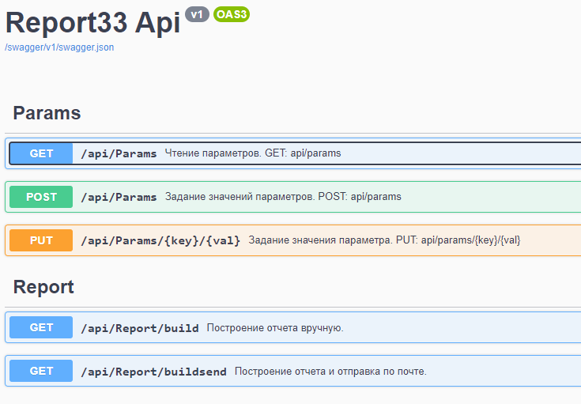

# Rep33Server

## Backend of reporting system.

-Process data from Oracle DB and save results into table.
-Report could be build online and sent to recipients.
-Also report could be produced from saved data in DB.
-Report use Excel shablon and three XML pages for every page of shablon.
-Backend has to be deployed into docker container.
-Usually it works by schedule and stores it and another parameters in configuration file.

It has swagger.

Frontend to manage [Client](https://github.com/Veivan/Rep33Client)